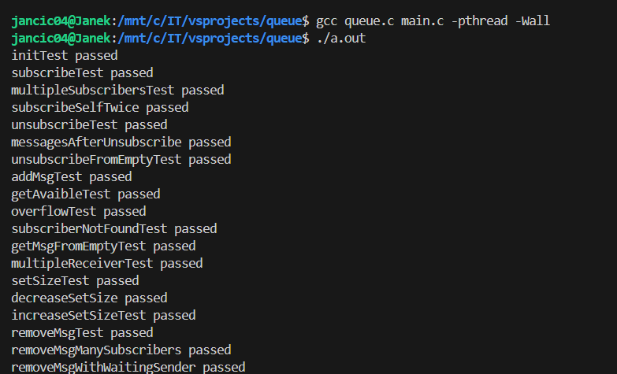

Projekt jest dostępny w repozytorium pod adresem:  
<https://github.com/CichyJohnny/thread-safe-c-publish-subscribe>.


# Struktury danych

W projekcie do implementacji zostały użyte 3 struktury

Główna z nich, reprezentująca samą kolejkę publish subscribe którą importujemy w kodzie wygląda następująco

```c
typedef struct TQueue {
    Message *messages_head;
    int capacity;
    int size;
    Subscriber *subscribers_head;
    int subscriber_count;
    pthread_mutex_t mutex;
    pthread_cond_t not_full;
    pthread_cond_t not_empty;
} TQueue;
```

Składa się ona z charakterystycznych atrybutów takich jak:

* pojemność kolejki i jej aktualny rozmiar
* muteksa
* dwóch zmiennych warunkowych blokujących listę pustą lub pełną
* wskaźników do głów dwóch początków obu list.

Pierwsza z list to dynamiczna lista (Singly Linked List) przechowujaca wiadomości wysłane za pośrednictwem kolejki. Składa się ona z elementów zaimplementowanych w strukturze Message:

```C
typedef struct Message {
    void *data;
    int undelivered;
    struct Message* next;
} Message;
```

Drugą listę stanowi dynamiczna lista (również Singly Linked List) przechowująca składająca się z poniższych elementów strukty Subscriber:

```c
typedef struct Subscriber {
    pthread_t thread;
    int new_messages;
    struct Subscriber* next;
} Subscriber;
```

# Funkcje

Zadanie zostało skontruowane w pełni przy pomocy wzorców funkcji podanych w treści zadania.

# Algorytm

Podczas testowano wykryto i naprawiono sytuacje skrajne:

* próba ponownego subskrybowania kolejki przez ten sam wątek
* dostęp do funkcji przez wątek któty nie subskrybuje kolejki
* wpływ funkcji setSize() na wiadomości, subskrybentów oraz czekające wątki
* dodawanie wiadomości do kolejki bez subskrybentów
* wpływ anulowania subskrybcji na ilość wiadomości


Odporność algorytmu na typowe problemy przetwarzania współbieżnego:

* Aktywne czekanie - użyto zmiennych warunkowych które zamiast aktywnej pętli zostają uśpione w oczekiwaniu na sygnał od wątku udostępniającego zasoby
* Zakleszczenie - dwie funkcje addMsg oraz getMsg wykluczają problem zakleszczenia, tzn. w przypadku zablokowania wątku wywołującego addMsg, funkcja getMsg zwalnia dla niego zasoby, jak i przy zablokowania wątku wywołującego getMsg, addMsg udostępnia mu zasoby - nie istnieje sytuacja wzajemnego zakleszczenia


# Przykład użycia

Program zapisany w języku C można skompilować za pomocą dowolnego kompilatora a następnie urochomić

`gcc main.c queue.c`

Przeprowadzony zostanie wówczas zestaw testów przygotowany by przetestować standardowe funkcje algorytmu jak i różnego typu sytuacje skrajne



-------------------------------------------------------------------------------